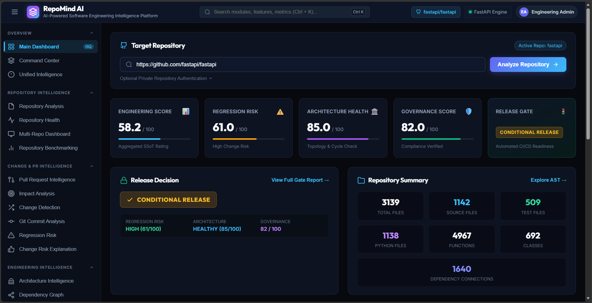
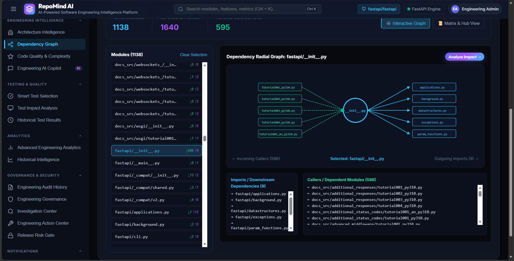
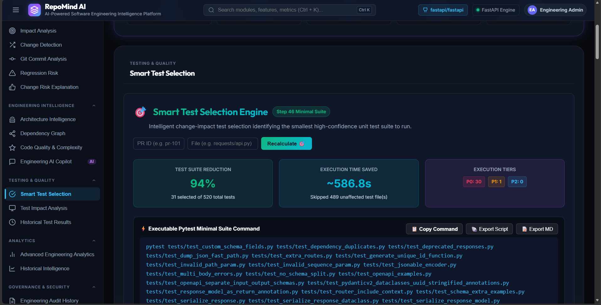
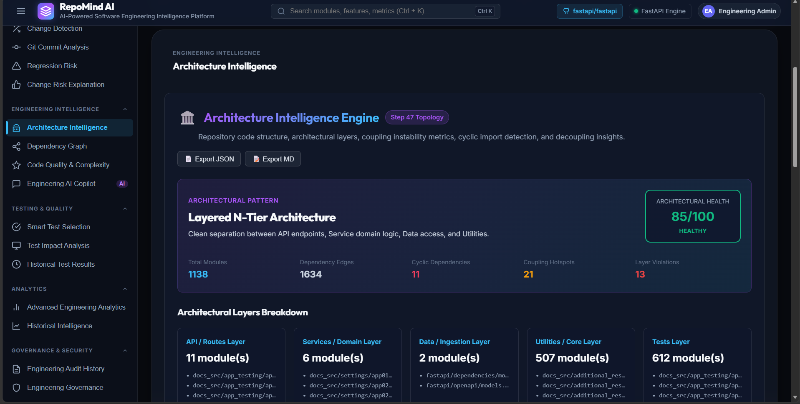

---

## 📊 Platform Overview

RepoMind AI provides a unified engineering dashboard for analyzing software repositories and understanding potential risks associated with code changes.

The dashboard brings together repository metrics, engineering health indicators, regression risk, architecture health, governance status, and release-gate decisions in a single view.

### Repository Analysis Dashboard

---

## 💥 Change Impact Analysis

RepoMind AI determines which components may be affected when a file or module changes.

It analyzes dependency relationships and estimates:

- Directly impacted components
- Transitively impacted components
- Impact radius
- Dependency propagation
- Change criticality

Example:

Changed File
     │
     ├── Direct Dependencies
     │
     ├── Dependent Modules
     │
     └── Transitive Impact
              │
              └── Potentially Affected Components

---

## 🔗 Dependency Intelligence

RepoMind AI builds a dependency graph to understand how modules and components are connected.

It provides:

- Dependency relationships
- Incoming callers
- Outgoing imports
- Dependency connections
- High-impact modules
- Dependency propagation paths
- Interactive dependency exploration

### Dependency Graph

---

## 🧪 Smart Test Selection

RepoMind AI identifies tests that are most relevant to a code change instead of requiring the entire test suite to run.

It analyzes change-to-test relationships and produces a prioritized test execution plan.

Key capabilities include:

- Impact-based test selection
- Test prioritization
- P0/P1/P2 execution tiers
- Confidence scoring
- Direct and indirect impact tracing
- Minimal test-suite generation
- Unaffected test identification

### Smart Test Selection

---

## 🏛️ Architecture Intelligence

RepoMind AI analyzes repository structure and dependency relationships to understand the overall software architecture.

It identifies architectural patterns, module relationships, dependency cycles, coupling hotspots, and potential layer violations.

Key capabilities include:

- Architectural pattern detection
- Module and dependency analysis
- Coupling hotspot detection
- Cyclic dependency detection
- Layer violation analysis
- Architectural health scoring
- Layer-wise repository breakdown

### Architecture Intelligence

---

## 📈 Regression Risk Analysis

RepoMind AI evaluates the potential regression risk associated with software changes by combining change impact, dependency relationships, code complexity, and affected components.

It helps engineering teams identify high-risk changes before they reach production.

Key capabilities include:

- Change risk scoring
- Regression risk prediction
- Impact radius analysis
- Dependency-based risk evaluation
- Complexity-aware risk assessment
- High-risk component identification
- Release risk assessment

---

## 🔍 Pull Request Intelligence

RepoMind AI analyzes pull requests to understand the engineering impact and potential risks before changes are merged.

It combines changed-file analysis, dependency impact, regression risk, code quality, governance, and testing insights into a unified pull request assessment.

Key capabilities include:

- Changed-file analysis
- Change intensity assessment
- Regression risk evaluation
- Dependency impact analysis
- Recommended test identification
- Governance and quality assessment
- Automated pull request verdict
- Release-gate decision

---

## ⚙️ Engineering Workflow

RepoMind AI integrates repository analysis, change intelligence, dependency analysis, testing insights, and engineering quality assessment into a unified workflow.

A typical analysis flow is:

Repository
    ↓
Repository Analysis
    ↓
Architecture & Dependency Intelligence
    ↓
Change Impact Analysis
    ↓
Regression Risk Assessment
    ↓
Smart Test Selection
    ↓
Engineering & Governance Evaluation
    ↓
Release Decision

---

## 🛠️ Technology Stack

RepoMind AI is built using a modern software engineering stack designed for repository analysis, backend intelligence, and interactive visualization.

| Layer | Technologies |
|---|---|
| Frontend | React, TypeScript, Vite |
| Backend | Python, FastAPI |
| API | REST API, OpenAPI |
| Analysis | Repository, AST, dependency and change analysis |
| Testing | Pytest |
| Visualization | Interactive dependency and engineering dashboards |
| Version Control | Git, GitHub |

---

## 📁 Project Structure

RepoMind AI follows a modular architecture that separates the frontend, backend services, analysis engines, tests, and documentation.

RepoMind-AI/
├── backend/
│   ├── app/
│   │   ├── api/
│   │   ├── services/
│   │   └── main.py
│   └── requirements.txt
│
├── frontend/
│   └── src/
│       ├── components/
│       ├── pages/
│       └── types/
│
├── tests/
├── docs/
├── screenshots/
├── README.md
├── .gitignore
└── pyproject.toml

---

## 🚀 Setup & Usage

### 1. Clone the Repository

git clone https://github.com/naveesh1/repomind-ai.git
cd repomind-ai

### 2. Run the Backend in First powershell

$env:PYTHONPATH="backend"

uvicorn app.main:app --reload

INFO:Uvicorn running on http://127.0.0.1:8000     

(ADD / AT LAST (http://127.0.0.1:8000/ ) TO RUN BACKEND)

### 3. Run the Frontend in Second powershell

npm --prefix frontend run dev

### 4. Try with a Public Repository

RepoMind AI can analyze publicly accessible GitHub repositories.

For a quick demonstration, try one of these repositories:

- https://github.com/fastapi/fastapi
- https://github.com/pallets/flask (DEFAULT FILE AS IT SHOWS IN FRONTEND)
- https://github.com/psf/requests

Example repository URL:

https://github.com/fastapi/fastapi

Enter the repository URL in RepoMind AI and run the analysis to explore repository metrics, dependency relationships, change impact, regression risk, architecture intelligence, and test selection.

---

## 🎯 Why RepoMind AI?

Traditional code review and static analysis tools often focus on individual code issues such as bugs, style violations, or security problems.

RepoMind AI takes a broader engineering perspective by analyzing how a code change can affect the overall repository.

It combines:

- Repository structure analysis
- Architecture intelligence
- Dependency graph analysis
- Change impact analysis
- Regression risk assessment
- Pull request intelligence
- Smart test selection
- Code quality analysis
- Governance and release readiness

The goal is to help software engineering teams understand **what may be affected by a change, how risky the change is, which tests should be executed, and whether the repository is ready for release**.

---

## 🧪 Testing & Validation

RepoMind AI includes automated testing and build validation to ensure the platform remains stable as analysis capabilities evolve.

Validation includes:

- Backend unit and integration tests
- API endpoint validation
- Repository analysis testing
- Change impact analysis testing
- Notification and integration testing
- Frontend TypeScript validation
- Production frontend build verification

The backend test suite and frontend production build were successfully validated during development.

---

## 🚀 Future Enhancements

RepoMind AI can be extended with additional capabilities to support larger and more complex software engineering workflows.

Planned enhancements include:

- GitHub and GitLab pull request automation
- CI/CD pipeline integration
- Historical change and regression learning
- Organization-level engineering analytics
- Advanced AI-assisted code change recommendations
- Continuous repository health monitoring
- Automated release risk notifications
